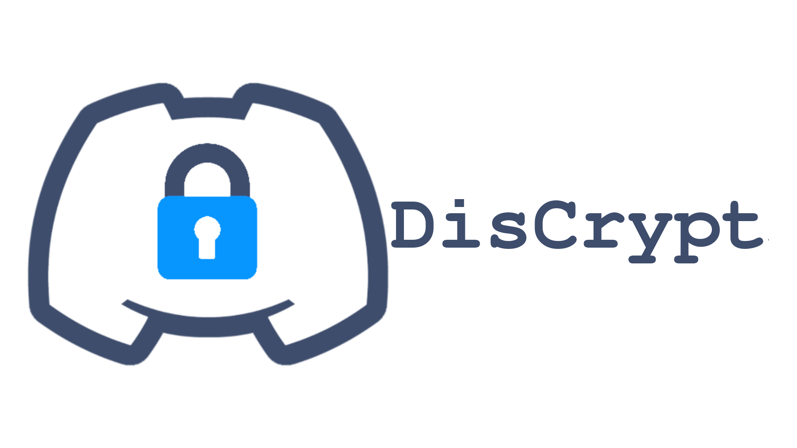
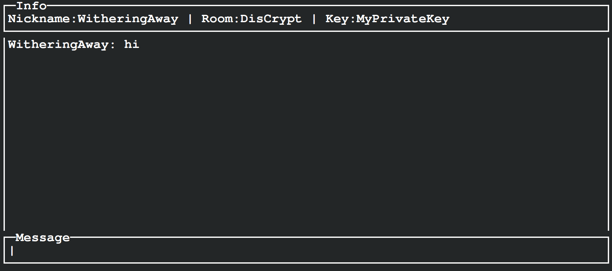

[](https://discord.gg/pR7Y3kBbay)
[](https://github.com/NotWithering/discrypted/blob/master/LICENSE)

**DisCrypt** is a secure and accountless chat program that operates in the terminal/command line interface.
It leverages Discord's Bot API to facilitate encrypted communication between users.
User-defined encryption keys to ensure maximum control.

This project was built and maintained by one person.
If you have a fix or want to implement a feature, make a pull request!



## Table of Contents

- [Installation](#installation)
    - [Building from source](#building-from-source)
    - [Running](#running)
        - [Linux](#linux)
        - [Windows](#windows)

## Installation

### Building from source

```bash
git clone https://github.com/NotWithering/discrypted
cd discrypted
```

```bash
go build .
```

### Running

#### Linux

```bash
./main
```

#### Windows

```bash
./main.exe
```